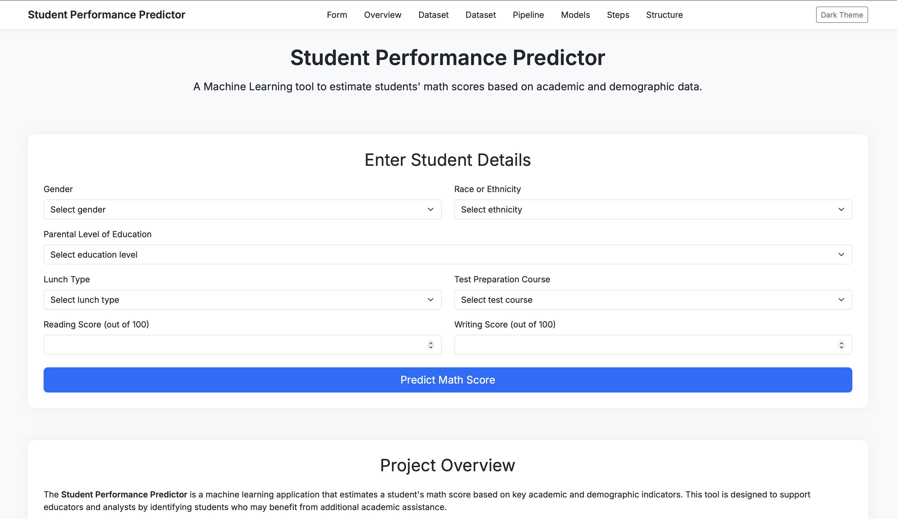
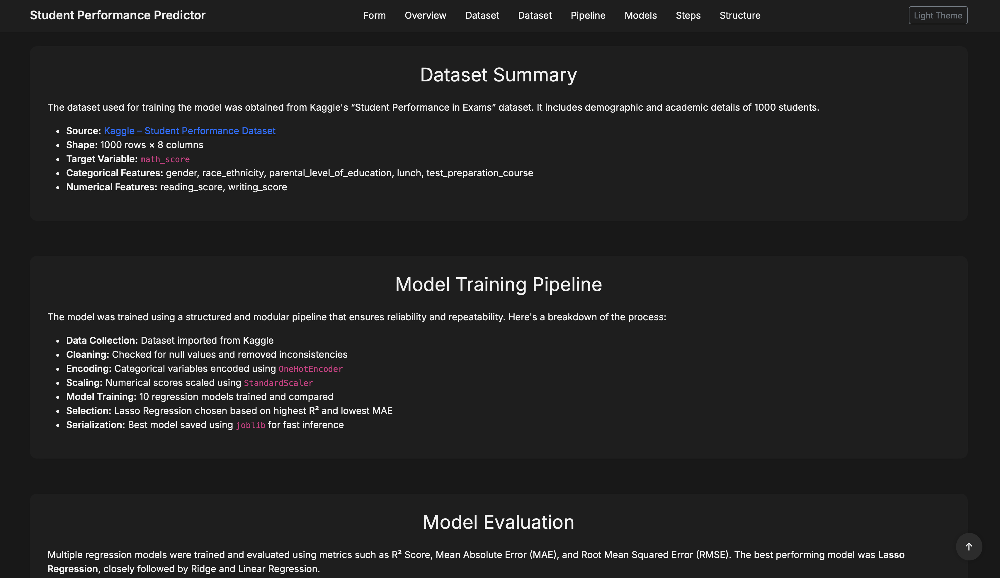

<h1>Student Performance Predictor</h1>

A complete end-to-end Machine Learning project that predicts a student's <strong>math score</strong>
based on various academic and demographic inputs. This project demonstrates the full ML pipeline —
from data ingestion and preprocessing to training, evaluation, and deployment using Flask.

<h2>Features</h2>

  

<ul>
  <li>End-to-end ML pipeline: data ingestion → transformation → model training → prediction</li>
  <li>GridSearchCV-style hyperparameter tuning across <strong>10 regression models</strong></li>
  <li>Final trained model integrated into a web app via Flask</li>
  <li>Clean modular code under <code>src/</code> for easy scalability and reuse</li>
  <li>Includes real-world dataset from Kaggle with EDA and preprocessing</li>
</ul>

<h2>Tech Stack</h2>

<ul>
  <li>Python</li>
  <li>Flask – web framework</li>
  <li>pandas, numpy – data manipulation</li>
  <li>matplotlib, seaborn – EDA & plotting</li>
  <li>scikit-learn – ML algorithms, preprocessing, metrics</li>
  <li>XGBoost, CatBoost – boosting regressors</li>
  <li>joblib, dill – model serialization</li>
  <li>HTML, CSS, JavaScript – frontend styling and interactivity </li>
</ul>

<h2>Problem Statement</h2>

To predict a student's <strong>math score</strong> based on various features such as gender, race/ethnicity,
parental education, lunch type, and test preparation course — helping educators identify students
who may need academic support.

<h2>Dataset</h2>

<strong>Source:</strong> <a href="https://www.kaggle.com/datasets/spscientist/students-performance-in-exams" target="_blank">Kaggle – Student Performance Dataset</a>

<strong>Shape:</strong> 1000 rows × 8 columns

<strong>Target Variable:</strong> <code>math_score</code>

<h3>Features</h3>

<ul>
  <li>Categorical: <code>gender</code>, <code>race_ethnicity</code>, <code>parental_level_of_education</code>, <code>lunch</code>, <code>test_preparation_course</code></li>
  <li>Numerical: <code>reading_score</code>, <code>writing_score</code></li>
</ul>

<h2>EDA Summary</h2>

<ul>
  <li>No missing or duplicate values</li>
  <li>Performance varies by gender, parental education level, and test preparation</li>
  <li>High correlation between reading/writing scores and math score</li>
</ul>

<h2>Data Preprocessing</h2>

<ul>
  <li><strong>Numerical:</strong> Scaled using <code>StandardScaler</code></li>
  <li><strong>Categorical:</strong> Encoded using <code>OneHotEncoder</code></li>
  <li>Combined using <code>ColumnTransformer</code></li>
  <li>Serialized using <code>joblib</code> and stored as <code>preprocessor.pkl</code></li>
</ul>

<h2>Model Training & Selection</h2>

<h3>Models Evaluated</h3>

  

<ul>
  <li>Linear Regression, Lasso, Ridge</li>
  <li>K-Nearest Neighbors</li>
  <li>Decision Tree, Random Forest</li>
  <li>XGBoost, CatBoost, AdaBoost, Gradient Boosting</li>
</ul>

<strong>Tuning:</strong> Manual <code>GridSearchCV</code> via custom parameter dictionary per model

<strong>Evaluation Metrics:</strong> R² Score, MAE, RMSE

<h3>Final Model: Lasso Regression</h3>

<table>
  <thead>
    <tr>
      <th>Model</th>
      <th>R² Score</th>
      <th>MAE</th>
      <th>RMSE</th>
    </tr>
  </thead>
  <tbody>
    <tr><td>Lasso (Best)</td><td>0.8806</td><td>4.21</td><td>5.39</td></tr>
    <tr><td>Ridge</td><td>0.8805</td><td>4.21</td><td>5.39</td></tr>
    <tr><td>Linear Regression</td><td>0.8804</td><td>4.21</td><td>5.39</td></tr>
    <tr><td>CatBoost Regressor</td><td>0.8614</td><td>4.46</td><td>5.81</td></tr>
    <tr><td>Gradient Boosting</td><td>0.8610</td><td>4.49</td><td>5.82</td></tr>
    <tr><td>AdaBoost Regressor</td><td>0.8519</td><td>4.68</td><td>6.00</td></tr>
    <tr><td>XGBoost Regressor</td><td>0.8495</td><td>4.65</td><td>6.05</td></tr>
    <tr><td>Random Forest Regressor</td><td>0.8461</td><td>4.70</td><td>6.12</td></tr>
    <tr><td>K-Neighbors Regressor</td><td>0.5786</td><td>7.94</td><td>10.13</td></tr>
    <tr><td>Decision Tree Regressor</td><td>0.5492</td><td>8.05</td><td>10.47</td></tr>
  </tbody>
</table>

<h2>Project Structure</h2>

<pre>
.
├── app.py                   # Flask application entry point
├── templates/               # HTML templates
├── data/                    # Raw data (stud.csv)
├── notebook/                # EDA and model training notebooks
├── artifacts/               # Serialized model & preprocessor
├── requirements.txt         # Project dependencies
├── README.md                # Project documentation
├── src/
│   ├── components/          # Data ingestion, transformation, model training
│   ├── pipeline/            # train and predict pipelines
│   ├── utils.py             # Utility functions
│   └── exception.py         # Custom exception handler
</pre>

<h2>Preview</h2>

Here’s a glimpse of the locally running application:

  
  

<h2>Author</h2>

<strong>Kunal Sharma</strong>

Email: <a href="mailto:kunals7943@gmail.com">kunals7943@gmail.com</a>

B.Tech Chemical Engineering Student at IIT Delhi

Passionate about Machine Learning, Full Stack Development, and Software Engineering

<a href="https://www.linkedin.com/in/kunal-sharma-112010263/" target="_blank">LinkedIn Profile</a>
